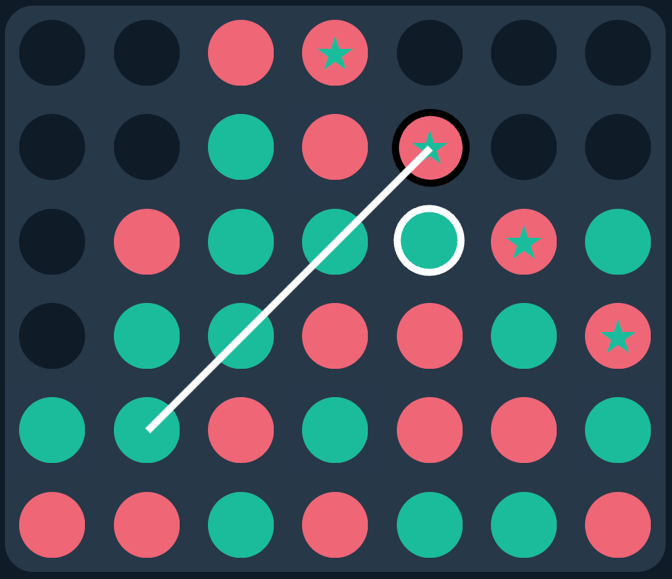

# Connect 4 MCTS

This project is an implementation of [Monte Carlo tree search](https://en.wikipedia.org/wiki/Monte_Carlo_tree_search) (MCTS) for [Connect 4](https://en.wikipedia.org/wiki/Connect_Four). Briefly, MCTS is a simulation-based algorithm that uses random sampling and heuristics to make decisions in a game or problem-solving scenario. Generally, there are four steps:

- Selection: traversing the game tree to select a promising node while balancing [exploration and exploitation](https://en.wikipedia.org/wiki/Exploration-exploitation_dilemma). This implementation uses UCT (UCB applied to trees)
- Expansion: add the child nodes of the promising node
- Simulation: complete random play-outs or rollouts for each child
- Backpropagation: update the statistics of the nodes along the path from the root to the selected node

## Notes

Dealing with terminal states (i.e., states that end the game) was extremely troublesome. My main difficulty was coming to the realization that

> terminal states inform the states that lead to them through backpropagation.

To speed up computation, my earlier implementations overlooked states that were won. After all, why simulate a game when its outcome is certain? Then, I started to notice strange behavior, such as the AI making moves that seemingly handed its opponent an immediate win. This is because,

> at its heart, MCTS has no knowledge of the game. It simply makes random moves.

Consider the following game state, which I encountered while facing the AI off against real players:

The AI made the move in white, which was immediately followed by the winning move in black. How could it make such an obvious blunder?? Then it hit me: the AI doesn't simulate terminal states, so it didn't even consider the move in black. Instead, it considered every other move—which lo and behold **would've allowed the AI to win in the next move, playing in the exact slot that was overlooked**—explaining why it made the move in the first place.

The updated implementation takes the opposite approach, not only simulating terminal moves but also prioritizing them, allowing them to inform all the nodes above them.